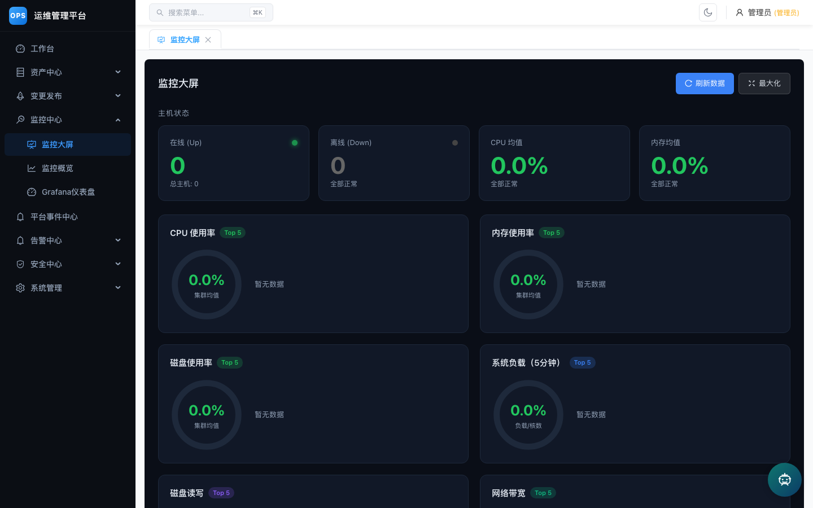
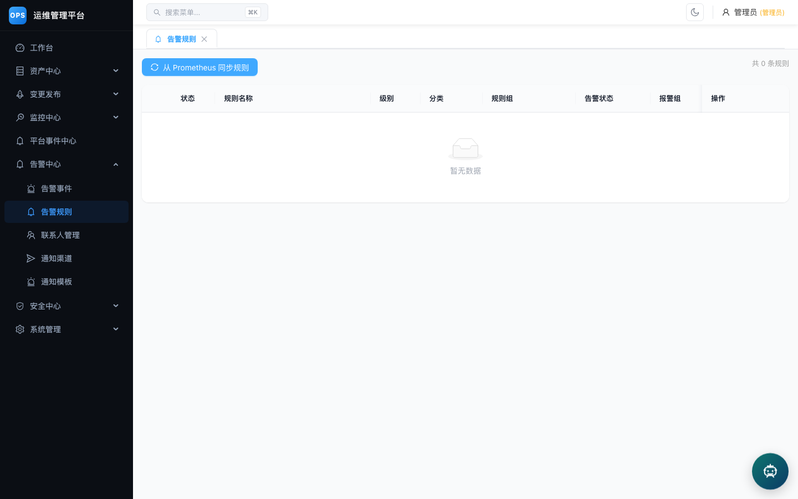

# OPS Platform

<div align="center">

**运维管理平台 — CMDB、CI/CD、安全扫描、告警监控一体化**

[](LICENSE)
[](https://go.dev/)
[](https://react.dev/)
[](https://www.typescriptlang.org/)
[](https://www.docker.com/)

</div>

---

## 功能概览

| 模块 | 说明 |
|------|------|
| **CMDB** | 项目、环境、服务器、应用资产管理 |
| **CI/CD** | Jenkins 集成，应用部署与归档发布 |
| **聚合打包** | 多应用聚合打包，Consul 配置驱动 |
| **Consul 管理** | 配置管理、批量复制、管道替换 |
| **告警中心** | 规则管理、联系人、渠道、模板、Webhook |
| **监控大屏** | Grafana 仪表盘代理、健康检查、Prometheus 集成 |
| **安全扫描** | 主机扫描、Web 扫描、漏洞管理、FIM 文件完整性监控 |
| **运维小助手** | AI 对话助手，支持 Ollama 本地模型及主流第三方模型 |
| **权限管理** | JWT 认证、RBAC 角色权限、菜单控制 |
| **审计日志** | 操作审计、平台事件流 |

## 界面预览

| 工作台 | CMDB 项目管理 |
|--------|---------------|
|  |  |

| 监控大屏 | 安全扫描 |
|----------|----------|
|  |  |

| 部署发布 | 告警规则 | 运维小助手 |
|----------|----------|------------|
|  |  |  |

## 技术栈

**后端**: Go 1.25 · Gin · GORM · MySQL 8.0 · Redis 7.4 · Zap

**前端**: React 18 · TypeScript · Vite · Ant Design 5 · Axios

**基础设施**: Docker Compose · Nginx · Ollama (可选)

## 快速开始

### 前置条件

- Docker 20.10+ & Docker Compose 2.0+
- 至少 4GB 可用内存

### 开发环境

```bash
git clone git@github.com:jenvenson/ops-platform.git
cd ops-platform/deploy

# 复制并编辑环境变量
cp .env.example .env
# 至少修改 DB_PASSWORD、REDIS_PASSWORD、JWT_SECRET

# 启动开发环境
docker compose -f docker-compose.dev.yml up -d
```

访问地址：
- 前端入口: http://localhost:8890
- 后端 API: http://localhost:8080
- 默认账号: `admin` / `admin123`

### 生产环境

详见 [部署指南](deploy/DEPLOY.md)

## 项目结构

```
├── backend/                # Go 后端
│   ├── cmd/server/         # 入口
│   ├── internal/           # 业务模块 (cmdb/security/alert/assistant/...)
│   ├── pkg/                # 公共工具包 (config/logger/jenkins/consul)
│   ├── configs/            # 配置文件
│   ├── migrations/         # 数据库迁移
│   └── scripts/            # 初始化脚本
├── frontend/               # React 前端
│   └── src/
│       ├── api/            # API 客户端
│       ├── components/     # 公共组件 (MainLayout, AIChatbot)
│       ├── pages/          # 页面 (cmdb/security/alarm/deploy/...)
│       └── styles/         # 主题样式
├── deploy/                 # 部署配置
│   ├── docker-compose.yml        # 生产环境
│   ├── docker-compose.dev.yml    # 开发环境
│   ├── Dockerfile.backend        # 后端镜像
│   ├── nginx.prod.conf.template  # Nginx 模板
│   ├── deploy-init.sh            # 首次部署
│   └── deploy-update.sh          # 迭代更新
├── docs/                   # 文档与截图
└── migrations/             # 历史补充迁移
```

## 架构

```
Browser → Nginx (:80)
            ├── /api/*        → Backend (:8080) → MySQL + Redis
            ├── /grafana-proxy → Grafana
            └── /*            → Frontend static files
```

后端模块依赖：

```
auth → cmdb / security / alert / consul / cicd / assistant
                   ↓
            platformevent / platformobject
                   ↓
              database (MySQL + Redis)
```

## 运维小助手

内置 AI 对话助手，支持通过 Ollama 运行本地模型，也可接入第三方模型 API：

```bash
# 本地 Ollama
ASSISTANT_PROVIDER=ollama
OLLAMA_BASE_URL=http://localhost:11434
OLLAMA_CHAT_MODEL=qwen3:8b

# 第三方模型 (DeepSeek / 通义千问 / GLM / Kimi / MiniMax / 豆包 等)
ASSISTANT_PROVIDER=deepseek
ASSISTANT_API_KEY=sk-your-api-key
```

支持的工具调用：CMDB 查询、告警管理、部署操作、安全扫描。

## 文档

- [部署指南](deploy/DEPLOY.md)
- [用户手册](docs/user_manual.md)
- [测试说明](docs/testing.md)
- [贡献指南](CONTRIBUTING.md)

## 社区

- [提交 Issue](https://github.com/jenvenson/ops-platform/issues)
- [安全漏洞报告](SECURITY.md)

## License

本项目采用 [MIT License](LICENSE)，可自由使用、修改和分发。

如需商业授权或合作，请通过 [GitHub Issues](https://github.com/jenvenson/ops-platform/issues) 联系我们。
