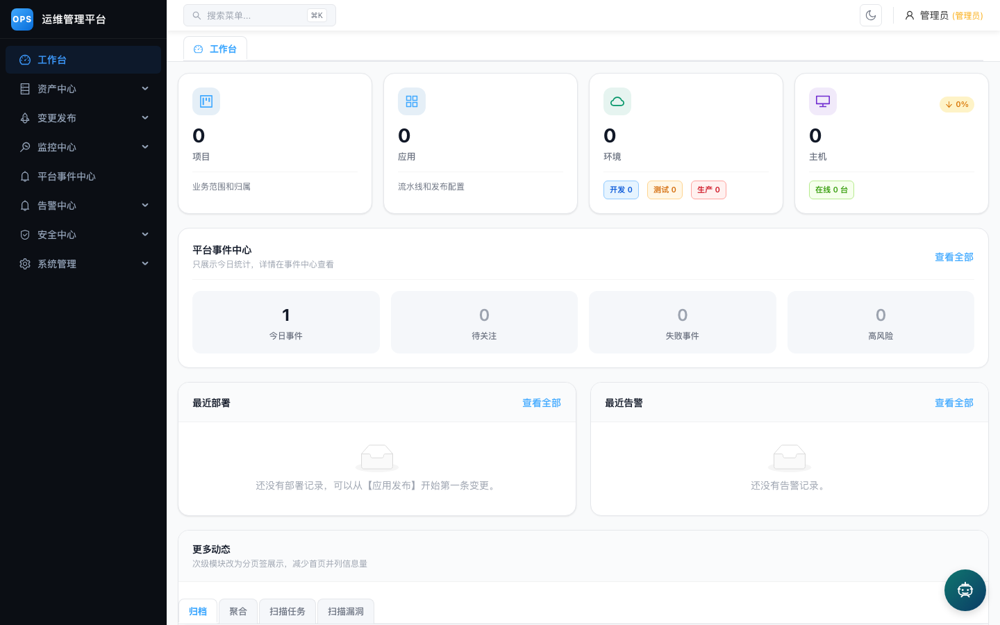
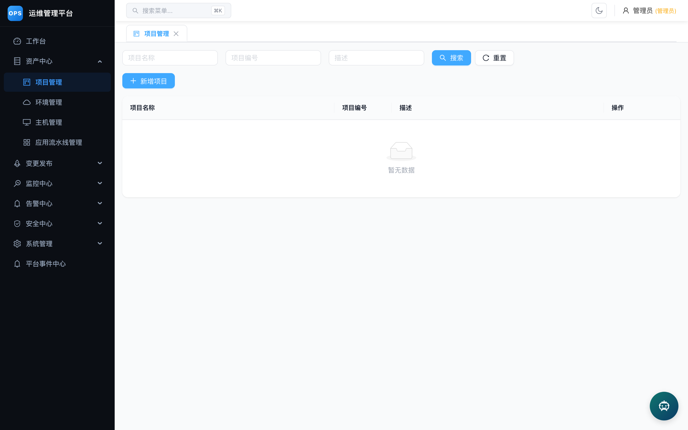
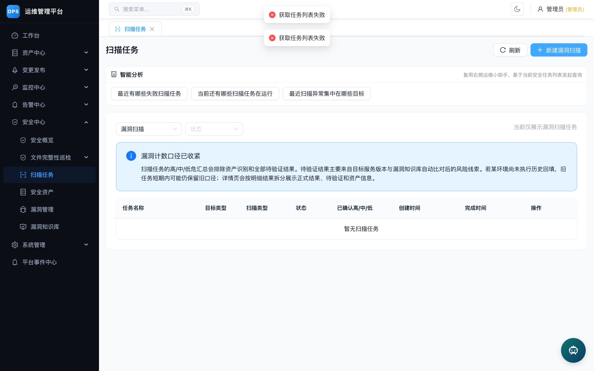
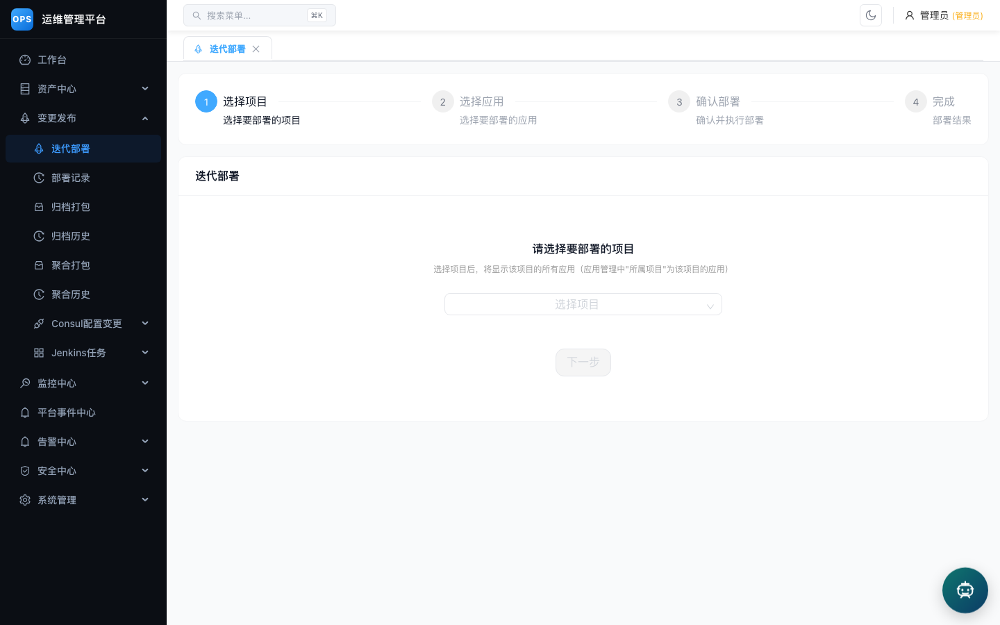
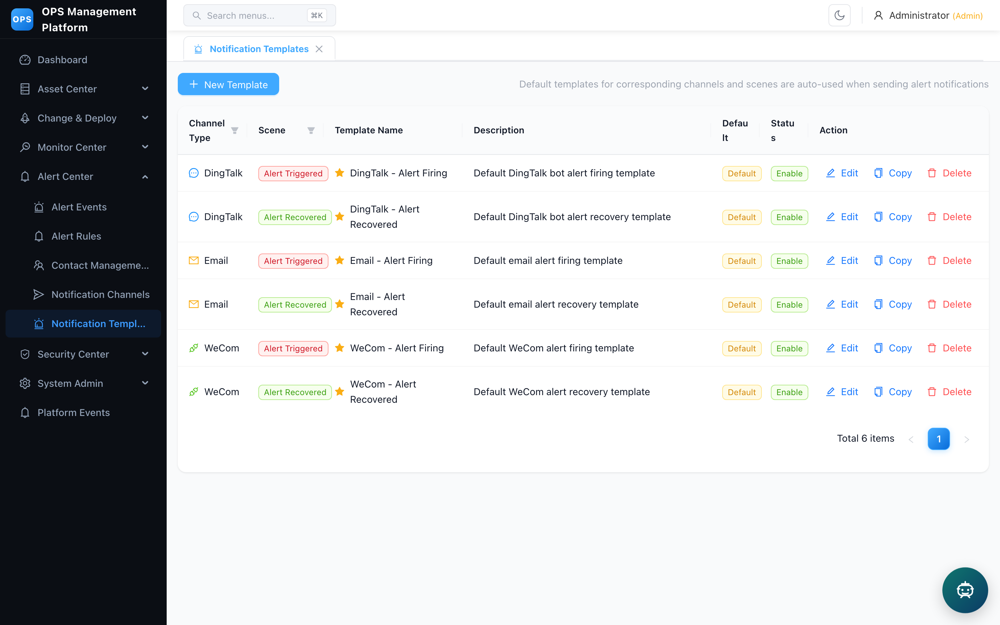
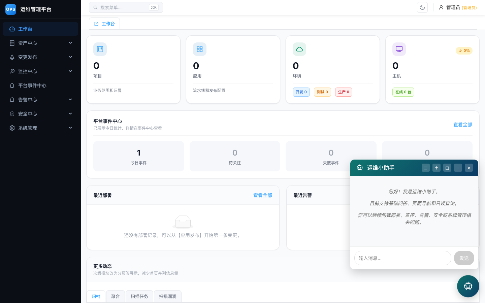

# OPS Platform

<div align="center">

**运维管理平台 — CMDB、CI/CD、安全扫描、告警监控一体化**

[](LICENSE)
[](https://github.com/jenvenson/ops-platform/actions/workflows/ci.yml)
[](https://go.dev/)
[](https://react.dev/)
[](https://www.typescriptlang.org/)
[](https://www.docker.com/)

中文 | [English](README.en.md)

</div>

---

## 功能概览

| 模块 | 说明 |
|------|------|
| **CMDB** | 项目、环境、服务器、应用资产管理 |
| **CI/CD** | Jenkins 集成，应用部署与归档发布 |
| **聚合打包** | 多应用聚合打包，Consul 配置驱动 |
| **Consul 管理** | 配置管理、批量复制、管道替换 |
| **告警中心** | 规则管理、联系人、渠道、模板、Webhook |
| **监控大屏** | Grafana 仪表盘代理、健康检查、Prometheus 集成 |
| **安全扫描** | 主机扫描、Web 扫描、漏洞管理、FIM 文件完整性监控 |
| **运维小助手** | AI 对话助手，支持 Ollama 本地模型及主流第三方模型，回答语言跟随界面语言 |
| **国际化** | 中英文界面一键切换，浏览器标题与系统名称同步翻译（自定义站点名保持原样） |
| **权限管理** | JWT 认证、RBAC 角色权限、菜单控制 |
| **审计日志** | 操作审计、平台事件流 |

## 界面预览

| 工作台 | CMDB 项目管理 |
|--------|---------------|
|  |  |

| 工作台（English） | 安全扫描 |
|-------------------|----------|
|  |  |

| 部署发布 | 告警模板（English） | 运维小助手 |
|----------|---------------------|------------|
|  |  |  |

## 技术栈

**后端**: Go 1.25 · Gin · GORM · MySQL 8.0 · Redis 7.4 · Zap

**前端**: React 18 · TypeScript · Vite · Ant Design 5 · Axios

**基础设施**: Docker Compose · Nginx · Ollama (可选)

## 快速开始

### 1. 克隆项目

```bash
git clone git@github.com:jenvenson/ops-platform.git
cd ops-platform
```

### 2. 配置环境变量

```bash
cp deploy/.env.example deploy/.env
```

编辑 `deploy/.env`，**至少修改以下三项**：

```ini
DB_PASSWORD=your_secure_mysql_password
REDIS_PASSWORD=your_secure_redis_password
JWT_SECRET=your_jwt_secret_key_change_in_production
```

### 3. 启动服务

```bash
docker compose -f deploy/docker-compose.dev.yml -p ops-dev up -d
```

首次启动拉取镜像并安装依赖，约需 3-5 分钟。

### 4. 验证

```bash
curl http://localhost:28080/health
# {"status":"ok","checks":{"database":"ok"}}
```

浏览器打开 **http://localhost:18890**，使用默认账号登录。

### 访问地址

| 服务 | 地址 | 说明 |
|------|------|------|
| 前端入口 | http://localhost:18890 | Web 管理界面 |
| 后端 API | http://localhost:28080 | REST API |
| MySQL | localhost:23306 | 数据库直连 |
| Redis | localhost:16379 | 缓存直连 |

### 默认账号

| 字段 | 值 |
|------|------|
| 用户名 | `admin` |
| 密码 | `admin123` |

> 首次登录后请在「个人中心」修改密码。

### 本地开发（前后端本地运行，Docker 跑 MySQL/Redis）

```bash
# 1. 只启动基础设施
docker compose -f deploy/docker-compose.dev.yml -p ops-dev up -d mysql redis

# 2. 后端 (终端 1)
cd backend
DB_HOST=localhost DB_PORT=23306 DB_PASSWORD=your_secure_mysql_password \
REDIS_HOST=localhost REDIS_PORT=16379 REDIS_PASSWORD=your_secure_redis_password \
JWT_SECRET=your_jwt_secret go run ./cmd/server/main.go

# 3. 前端 (终端 2)
cd frontend
pnpm install && pnpm dev
# Vite dev server 运行在 http://localhost:5173，自动代理 /api 到后端
```

### 常见问题

<details>
<summary><b>MySQL 连接失败 / Authentication plugin 错误</b></summary>

部分客户端不支持 MySQL 8.0 的 `caching_sha2_password`：

```bash
docker exec ops-mysql mysql -uroot -p -e \
  "ALTER USER 'root'@'%' IDENTIFIED WITH mysql_native_password BY 'your_password'; FLUSH PRIVILEGES;"
```
</details>

<details>
<summary><b>前端无法连接后端</b></summary>

确认 `deploy/.env` 中 `JWT_SECRET` 已设置，且后端容器 `ops-backend-dev` 已启动：

```bash
docker logs ops-backend-dev --tail 20
```
</details>

<details>
<summary><b>端口冲突</b></summary>

修改 `deploy/.env` 中的端口变量或直接编辑 `deploy/docker-compose.dev.yml` 的 `ports` 映射。
</details>

<details>
<summary><b>国内网络慢 / 依赖下载失败</b></summary>

在 `deploy/.env` 中设置 Go 模块代理：

```ini
GOPROXY=https://goproxy.cn,direct
```
</details>

## 项目结构

```
├── backend/                # Go 后端
│   ├── cmd/server/         # 入口
│   ├── internal/           # 业务模块 (cmdb/security/alert/assistant/...)
│   ├── pkg/                # 公共工具包 (config/logger/jenkins/consul)
│   ├── configs/            # 配置文件
│   ├── migrations/         # 数据库迁移
│   └── scripts/            # 初始化脚本
├── frontend/               # React 前端
│   └── src/
│       ├── api/            # API 客户端
│       ├── components/     # 公共组件 (MainLayout, AIChatbot)
│       ├── pages/          # 页面 (cmdb/security/alarm/deploy/...)
│       └── styles/         # 主题样式
├── deploy/                 # 部署配置
│   ├── docker-compose.yml        # 生产环境
│   ├── docker-compose.dev.yml    # 开发环境
│   ├── Dockerfile.backend        # 后端镜像
│   ├── Dockerfile.frontend       # 前端镜像
│   ├── nginx.conf.template       # Nginx 模板
│   ├── .env.example              # 环境变量示例
│   ├── deploy-init.sh            # 首次部署
│   └── deploy-update.sh          # 迭代更新
├── docs/                   # 文档与截图
└── migrations/             # 历史补充迁移
```

## 架构

```
Browser → Nginx (:80)
            ├── /api/*        → Backend (:8080) → MySQL + Redis
            ├── /grafana-proxy → Grafana
            └── /*            → Frontend static files
```

后端模块依赖：

```
auth → cmdb / security / alert / consul / cicd / assistant
                   ↓
            platformevent / platformobject
                   ↓
              database (MySQL + Redis)
```

## 运维小助手

内置 AI 对话助手，支持通过 Ollama 运行本地模型，也可接入第三方模型 API：

```bash
# 本地 Ollama
ASSISTANT_PROVIDER=ollama
OLLAMA_BASE_URL=http://localhost:11434
OLLAMA_CHAT_MODEL=qwen3:8b

# 第三方模型 (DeepSeek / 通义千问 / GLM / Kimi / MiniMax / 豆包 等)
ASSISTANT_PROVIDER=deepseek
ASSISTANT_API_KEY=sk-your-api-key
```

支持的工具调用：CMDB 查询、告警管理、部署操作、安全扫描。

## 国际化

- 顶栏一键切换中文 / English，全部页面、菜单、提示文案即时生效
- 浏览器标题与系统名称随语言切换翻译；管理员自定义的站点名称保持原样
- 运维小助手的回答语言自动跟随当前界面语言

## 文档

- [部署指南](deploy/DEPLOY.md)
- [用户手册](docs/user_manual.md)
- [测试说明](docs/testing.md)
- [贡献指南](CONTRIBUTING.md)

## 社区

- [提交 Issue](https://github.com/jenvenson/ops-platform/issues)
- [安全漏洞报告](SECURITY.md)

## License

本项目采用 [MIT License](LICENSE)，可自由使用、修改和分发。
